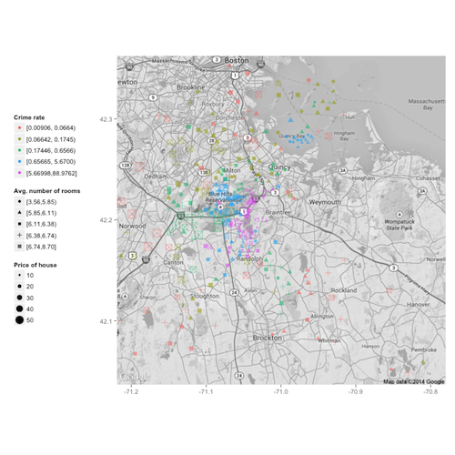

## 1. Introduction

Looking for a new place to live can be a really hard, time consuming (and expensive!) adventure, especially if you move to a new city and you are still learning which district you will fit in. [BostonRE](https://rosariomgomez.shinyapps.io/DevDataProducts/) is trying to solve this problem.

We are analyzing the relations between a set of measures and the house prices in the Boston area. Based on them, we build a predictive model that will estimate the price of a house for your input parameters.

The dataset for building this model is the BostonHousing2 from the mlbench library which contains 506 observations with 14 variables from the 1970 census. 

--- &twocol w1:75% w2:25%
## 2. Exploratory analysis

*** =left


*** =right
- The number of rooms seems related with price (shape vs size)
- Crime rate seems very correlated with location and price:
  We can identify clusters of data by color (crime rate). 
- We also observe that in high crime rate areas (purple), independently of 
the number of rooms the prices are lower than in other regions.

---

## 3. Model selection (I)

### Regression tree with all the predictors


```r
mean((pred1 - testing$cmedv)^2) #RMSE
```

```
## [1] 29.35
```

- Used variables by the model (from summary): rm, lstat, nox and crim

 

--- &twocol w1:75% w2:25%

## 4. Model selection (II) and Conclusions

*** =left

#### Random Forest:


```r
mean((pred3 - testing$cmedv)^2) #RMSE
```

```
## [1] 14.48
```

 

*** =right
- Random Forest outperforms from the rest of models. 
- The number of rooms and the percentage of lower status population are the most significant variables.
- Note: A simple linear model is implemented in the Shiny app in order to easily interact with the user.

Thanks for reading!!
====================
